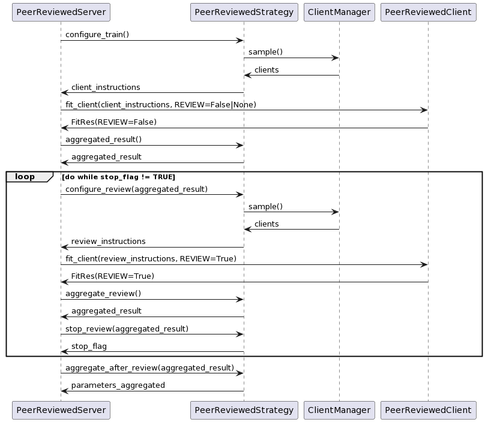
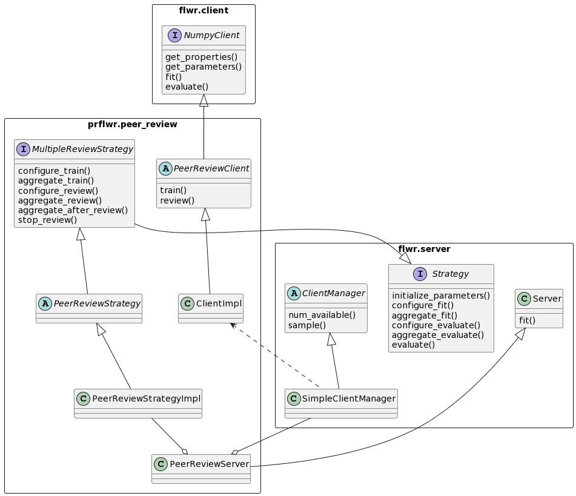

# Peer-reviewed Federated Learning in Flower

Peer reviewed federated learning usign Flower.

## Installation

Project dependencies are included in the ```requirement.txt``` file, install them using pip or similar tools.

## Class and sequence diagrams

### Sequence diagram of the federated training step:



### Class diagram of the federated training step:



## Examples

To run the centralized, federated and federated with peer review training examples, run the ```run.sh``` scripts in their respective directories.

## Tests

To run the centralized test (using only PyTorch):
```shell
python -m tests.test_centralized
```

To run the federated test (using PyTorch + Flower):
```shell
python -m tests.test_federated
```

To run the peer reviewed federated tests (using this library):
```shell
python -m tests.test_peer_reviewed
python -m tests.test_fed_pr_equivalence
```

To run all tests, including unit tests:
```shell
python -m unittest
```